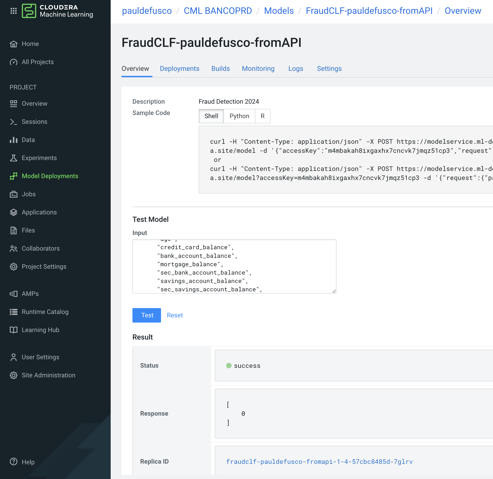

# CML BancoPrd HOL 12/04/24

Esta es la segunda parte del MLOps HOL (Hands-On Lab). La primera parte está disponible en el siguiente enlace: https://github.com/pdefusco/cml_mlops_hol_120424

### Instrucciones Para los Ejercicios

En esta segunda parte de los labs, desplegarás el modelo desde el Registry de MLFlow en un API Endppint para inferencia en tiempo real.

##### Despliegue de Proyecto

1. Visite [este enlace](https://github.com/pdefusco/cml_mlops_hol_prd_120424) para descargar todos los archivos.
2. Agrega un Runtimes de Python 3.9 con el editor de Workbench.
3. Cree el proyecto. Ingresa al proyecto y familiarízate con los archivos que se han subido.

##### Despliegue de Sesión y Instalación de Paquetes en Runtime

Abre una sesión con las siguientes opciones de Runtime.

```
Editor: Workbench
Kernel: Python 3.9
Edition: Standard
Version: 2023 o 2024
Enable Spark: Spark 3.2
Resource Profile: 2 CPU / 4 GB Mem / 0 GPU
```

Abre el terminal y instale los paquetes ejecutando el siguiente comando. Espera que la instalación de los paquetes termine antes que proseguir.

```
pip3 install -r requirements.txt
```

##### Despliegue de un modelo desde el Registro de MLFlow

Abre el script "03_api_deployment.py" y lo ejecute. No se requieren cambios de código. Note que el código comenzara a ejecutar a la derecha de la pantalla.

En este script, se utiliza una clase "ModelDeployment" para gestionar el despliegue del modelo desde el Registry de MLFlow. Los métodos de la clase amplían los métodos de la API que se proporcionan de forma predeterminada en cada Workspace.

Implementar una clase especificamente para su caso de uso es una forma común de implementar flujos de trabajo de MLOps en CML.

##### Despliegue del mismo model con mas recursos

Abre el script "03_api_redeployment.py" y lo ejecute. No se requieren cambios de código. Note que el código comenzara a ejecutar a la derecha de la pantalla.

Similar al script anterior, en este script se implementa una clase Python personalizada para gestionar el despliegue del modelo en producción. En particular, cuando un API Endpoint no puede manejar la carga de solicitudes entrantes, se puede implementar un nuevo contenedor con recursos adicionales. Esta es una práctica común en CML para gestionar modelos en producción, y la clase en el script proporciona un ejemplo simplificado de cómo hacerlo.




### Resumen

En esta sesión, utilizaste Sesiones de CML, MLFlow y la API de CML para desplegar un modelo de aprendizaje automático y procesos básicos de MLOps. En conclusion:

* En grandes organizaciones, generalmente se despliegan múltiples Workspaces para separar los ambientes de desarrollo y producción.

* Los Workspaces comparten el Registry de MLFlow, que actúa como un repositorio central para modelos y metadatos, y como un mecanismo para compartir modelos de un Workspace a otro. Los desarrolladores están bloqueados para crear puntos finales de API de modelos y solo pueden registrar modelos en MLFlow Tracking y Registry. Los administradores son los encargados de desplegar modelos como Endpoints.

* La API de CML permite a los desarrolladores aumentar la productividad al permitirles tanto acceder a los Experimentos de Modelos como Registrar Modelos con MLFlow de manera programática.
